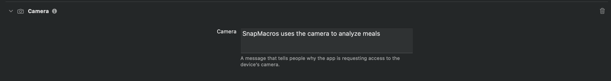

# SnapMacros Camera Capture Tutorial  
## Camera Capture → Image → OpenAI 

## Overview

This tutorial explains how SnapMacros handles camera images, step by step:

1. Tap **“Snap Meal”**
2. Open the **camera**
3. Capture an image and store it
4. Send the image to the **OpenAI API** for macro estimation
5. Show a **confirmation sheet** with the image and editable macros
6. Save the meal so it appears in the **Today** list with a thumbnail

We’ll focus only on the parts of the code that matter for:

- Camera capture (`CameraCaptureView`)
- Holding the image (`CameraViewModel`)
- Sending the image to OpenAI (`OpenAIClient` + `AnalysisViewModel`)
- Showing the image in the confirm sheet and in the meal list

---

## Getting Started

### Requirements

- Xcode installed
- iOS target that supports SwiftUI and `UIImagePickerController`
- A valid **OpenAI API key** (needed for the actual macro estimation) 

### Info.plist – Camera Permission

Because we use the device camera, we need a camera usage description (edit the info.plist):



```xml
<key>NSCameraUsageDescription</key>
<string>This app needs camera access to take meal photos for macro estimation.</string>
```

<iframe width="560" height="315"
src="https://www.youtube.com/embed/GAHWt2HPEIM"
title="YouTube video player" frameborder="0"
allow="accelerometer; autoplay; clipboard-write; encrypted-media; gyroscope; picture-in-picture"
allowfullscreen>
</iframe>

### OpenAI API Key

Snapmacros sends the image of your food to OpenAI to get the estimated macros, in order for it to work correctly a API key is needed for the calculation.
```swift
struct OpenAIClient {
    var model: String = "gpt-4o-mini"
    // Put your key here
    private let apiKey: String = "apikey"
}
```

---

## Step-by-Step: Camera → Image → AI

### CameraCaptureView – Wrapping UIImagePickerController in SwiftUI

CameraCaptureView is a SwiftUI view that shows either the camera or photo library and returns the picked image through a binding.

File: CameraCaptureView.swift
```swift
struct CameraCaptureView: View {
    @Binding var image: UIImage?
    @Environment(\.dismiss) private var dismiss
    @State private var useCamera = UIImagePickerController.isSourceTypeAvailable(.camera)

    var body: some View {
        UIKitImagePicker(source: useCamera ? .camera : .photoLibrary,
                         image: $image) {
            dismiss()
        }
        .ignoresSafeArea()
    }
}
```
The real work is done in the UIKitImagePicker bridge:
```swift
private struct UIKitImagePicker: UIViewControllerRepresentable {
    enum Source { case camera, photoLibrary }

    let source: Source
    @Binding var image: UIImage?
    var onFinish: () -> Void

    func makeUIViewController(context: Context) -> UIImagePickerController {
        let picker = UIImagePickerController()
        picker.sourceType = (source == .camera) ? .camera : .photoLibrary
        picker.allowsEditing = false
        picker.delegate = context.coordinator
        return picker
    }

    ...

    final class Coordinator: NSObject, UINavigationControllerDelegate, UIImagePickerControllerDelegate {
        let parent: UIKitImagePicker

        ...

        func imagePickerController(_ picker: UIImagePickerController,
                                   didFinishPickingMediaWithInfo info: [UIImagePickerController.InfoKey : Any]) {
            if let img = (info[.editedImage] ?? info[.originalImage]) as? UIImage {
                parent.image = img
            }
            parent.onFinish()
        }
    }
}
```
- CameraCaptureView decides camera vs photo library with useCamera.
- UIKitImagePicker uses UIImagePickerController under the hood.
- When the user picks/cancels, image (the binding) is updated and onFinish() closes the sheet.

Here are a few youtube tutorials I found that were also really helpful in integrating camera capture:

<iframe width="560" height="315"
src="https://www.youtube.com/watch?v=W60nnRFUGaI"
title="YouTube video player" frameborder="0"
allow="accelerometer; autoplay; clipboard-write; encrypted-media; gyroscope; picture-in-picture"
allowfullscreen>
</iframe>

<iframe width="560" height="315"
src="https://www.youtube.com/watch?v=hB8MTEJj3CA"
title="YouTube video player" frameborder="0"
allow="accelerometer; autoplay; clipboard-write; encrypted-media; gyroscope; picture-in-picture"
allowfullscreen>
</iframe>

### CameraViewModel – Where the Captured Image Lives

You keep the last captured image in a simple view model.

File: ViewModels.swift
```swift
final class CameraViewModel: ObservableObject {
    @Published var capturedImage: UIImage? = nil
}
```
This lets you:
- Bind CameraCaptureView directly to cameraVM.capturedImage.
- React to that image in HomeView once the picker dismisses.

### Wiring the camera in HomeView

HomeView contains the following:
- The “Snap Meal” button
- The sheet that shows CameraCaptureView
- The call to analyze the image with AI
- The confirm sheet that shows the result and image

This is the flow of the app:
	- Snap Meal → activeSheet = .camera
	- .camera sheet shows CameraCaptureView(image: $cameraVM.capturedImage)
	- When that sheet disappears, onDisappear checks cameraVM.capturedImage
	- If an image exists, analysisVM.analyze(image: img) is called
	- On success → activeSheet = .confirm (shows confirm sheet with image)
	- On confirm → MealEstimate is saved and image is stored in imageData

File: HomeView.swift
```swift
private enum ActiveSheet: Identifiable { case camera, confirm; var id: Int { hashValue } }

struct HomeView: View {
    ...
    @EnvironmentObject var cameraVM: CameraViewModel
    @EnvironmentObject var analysisVM: AnalysisViewModel

    @State private var activeSheet: ActiveSheet?
    @State private var showErrorAlert = false
    ...
    private let dailyLimit = 10

    var body: some View {
        NavigationStack {
            ScrollView {
                VStack(spacing: 20) {
                    ...
                    Button {
                        if !todayVM.canSnapAI(limit: dailyLimit) {
                            showUsageAlert = true
                            return
                        }
                        activeSheet = .camera
                    } label: {
                        HStack(spacing: 12) {
                            Image(systemName: "camera.fill")
                            Text("Snap Meal").font(.title2).bold()
                        }
                        .padding(.vertical, 16)
                        .frame(maxWidth: .infinity)
                    }
                    .buttonStyle(.borderedProminent)
                    .controlSize(.large)
                    .padding(.horizontal)
                    ...
                }
                ...
            }
            ...
            .sheet(item: $activeSheet) { sheet in
                switch sheet {
                case .camera:
                    CameraCaptureView(image: $cameraVM.capturedImage)
                        .ignoresSafeArea()
                        .onDisappear {
                            guard let img = cameraVM.capturedImage else { return }
                            Task { @MainActor in
                                await analysisVM.analyze(image: img)

                                if analysisVM.lastEstimate != nil {
                                    todayVM.recordAIUsage()
                                    // success → show confirm after picker fully dismisses
                                    try? await Task.sleep(nanoseconds: 150_000_000)
                                    activeSheet = .confirm
                                } else if analysisVM.errorMessage != nil {
                                    // failure → show alert; keep captured image so user can retry
                                    showErrorAlert = true
                                    activeSheet = nil
                                }
                            }
                        }

                case .confirm:
                    if let est = analysisVM.lastEstimate {
                        ConfirmAnalysisSheet(estimate: est) { didConfirm, calories, protein, carbs, fats in
                            if didConfirm {
                                let adjusted = MealEstimate(
                                    title: est.title,
                                    calories: calories,
                                    protein: protein,
                                    carbs: carbs,
                                    fats: fats,
                                    items: est.items,
                                    imageData: est.imageData,
                                    timestamp: est.timestamp
                                )
                                todayVM.add(estimate: adjusted)
                            }
                            analysisVM.clear()
                            cameraVM.capturedImage = nil
                            activeSheet = nil
                        }
                        .presentationDetents([.large])
                        .interactiveDismissDisabled(true)
                    } else {
                        Color.clear.onAppear { activeSheet = nil }
                    }
                }
            }
            ...
        }
    }
}
```


### AnalysisViewModel – Taking the UIImage and Triggering AI

```swift
@MainActor
final class AnalysisViewModel: ObservableObject {
    @Published var lastEstimate: MealEstimate?
    @Published var isAnalyzing = false
    @Published var errorMessage: String?

    private let client = OpenAIClient() // hardcoded key lives inside

    func analyze(image: UIImage) async {
        isAnalyzing = true
        errorMessage = nil
        defer { isAnalyzing = false }

        do {
            let estimate = try await client.analyzeMeal(from: image)
            self.lastEstimate = estimate
        } catch {
            ...
            self.lastEstimate = nil
        }
    }

    func clear() {
        lastEstimate = nil
        errorMessage = nil
    }
}
```

### OpenAIClient – Converting the UIImage and Sending It

OpenAIClient takes the UIImage, compresses it, converts it to base64, and sends it to the API.

The camera pipeline:
- jpeg is created directly from the captured UIImage
- dataURL is the base64 image given to OpenAI
- The MealEstimate that comes back stores imageData: jpeg, so you can show the same image again later

```swift
struct OpenAIClient {
    var model: String = "gpt-4o-mini"
    private let apiKey: String = "apikey"

    func analyzeMeal(from image: UIImage) async throws -> MealEstimate {
        guard !apiKey.isEmpty && apiKey != "apikey" else { throw OpenAIClientError.missingKey }
        guard let jpeg = image.jpegData(compressionQuality: 0.7) else { throw OpenAIClientError.badImage }
        let b64 = jpeg.base64EncodedString()
        let dataURL = "data:image/jpeg;base64,\(b64)"

        let systemPrompt = """
        You are a nutrition estimator. Return STRICT JSON ONLY:
        {
          "title": string,
          "calories": int,
          "protein": int,
          "carbs": int,
          "fats": int,
          "items": [
            { "name": string, "grams": int, "calories": int, "protein": int, "carbs": int, "fats": int }
          ]
        }
        If uncertain, give best reasonable estimates. No extra text, no markdown.
        """

        let userPrompt = "Estimate macros for this meal photo. Return ONLY the JSON object."

        let body: [String: Any] = [
            "model": model,
            "messages": [
                ["role": "system", "content": systemPrompt],
                [
                    "role": "user",
                    "content": [
                        ["type": "text", "text": userPrompt],
                        ["type": "image_url", "image_url": ["url": dataURL]]
                    ]
                ]
            ],
            ...
        ]

        ...
        // JSON decode → WireMeal → DetectedItem[]
        return MealEstimate(
            title: wire.title,
            calories: wire.calories,
            protein: wire.protein,
            carbs: wire.carbs,
            fats: wire.fats,
            items: items,
            imageData: jpeg,
            timestamp: Date()
        )
    }
}
```

### ConfirmAnalysisSheet – Showing the AI Result Image

ConfirmAnalysisSheet displays the image that came back as part of MealEstimate.


```swift
if let data = estimate.imageData, let ui = UIImage(data: data) {
    Image(uiImage: ui)
        .resizable()
        .scaledToFit()
        .frame(maxHeight: 200)
        .clipShape(RoundedRectangle(cornerRadius: 12))
        .padding(.horizontal)
        .padding(.top, 4)
}
```

### Today List – Showing the Meal Thumbnail

In the today feed, it will show a small thumbnail of the meal using the same imageData.


```swift
struct MealRow: View {
    let meal: MealEstimate

    var body: some View {
        HStack(spacing: 12) {
            if let data = meal.imageData, let ui = UIImage(data: data) {
                Image(uiImage: ui)
                    .resizable()
                    .scaledToFill()
                    .frame(width: 64, height: 64)
                    .clipShape(RoundedRectangle(cornerRadius: 12))
            } else {
                ZStack {
                    RoundedRectangle(cornerRadius: 12)
                        .fill(Color.secondary.opacity(0.15))
                    Image(systemName: "photo")
                }
                .frame(width: 64, height: 64)
            }
            ...
        }
    }
}
```

## Further Discussion / Conclusions

In this tutorial, we focused on the camera and image pipeline in SnapMacros:
- CameraCaptureView wraps UIImagePickerController and outputs a UIImage
- CameraViewModel holds that UIImage as capturedImage
- HomeView:
    - Presents the camera sheet
	- Calls analysisVM.analyze(image:) when the sheet closes
	- Shows a confirm sheet on success
- OpenAIClient:
    - Compresses the UIImage to JPEG
	- Sends it to OpenAI as a base64 data:image/jpeg;base64,...
	- Stores the returned MealEstimate with imageData
- ConfirmAnalysisSheet and MealRow:
    - Decode imageData and display the photo
 
## See Also

[https://developer.apple.com/documentation/avfoundation/photo-capture](https://developer.apple.com/documentation/avfoundation/photo-capture)
[https://developer.apple.com/documentation/avfoundation](https://developer.apple.com/documentation/avfoundation)
Youtube videos linked above in the tutorial


